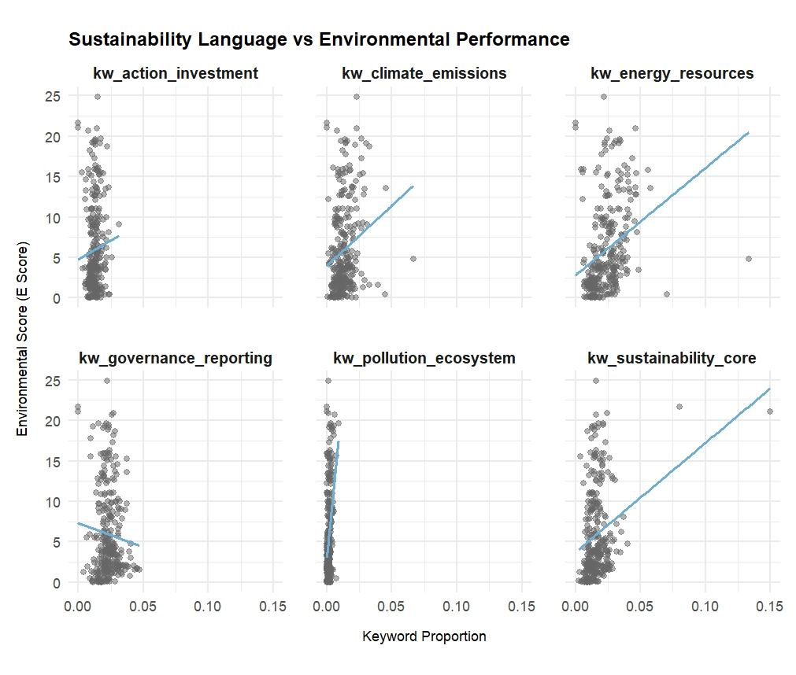

##

```{r}
#| label: setup
#| include: false

library(tidyverse)
library(rmarkdown)
library(ggthemes)
library(hrbrthemes)
library(skimr)
library(broom)
library(vip)
library(rpart)
library(rpart.plot)
library(ranger)

library(xgboost)

library(factoextra)
library(cluster)
library(fpc)
library(arules)
library(arulesViz)

theme_set(
  theme_ipsum() +
    theme(
      strip.background = element_rect(fill = "lightgray"),
      axis.title.x = element_text(size = rel(1.2)),
      axis.title.y = element_text(size = rel(1.2))
    )
)

set.seed(320)
```

# Project Overview

## Introduction

Environmental sustainability has become increasingly important in corporate strategy as consumers, investors, and regulators demand greater transparency regarding firms’ environmental impacts. ESG (Environmental, Social, and Governance) metrics are now widely used to evaluate corporate sustainability performance, and many firms publish sustainability reports highlighting environmental initiatives and commitments. However, concerns about greenwashing—the practice of overstating environmental responsibility through communication without corresponding actions—have also increased.

This raises an important question:

### Does sustainability communication align with actual environmental performance?

Understanding this relationship matters because sustainability reporting influences investor decisions, consumer trust, and regulatory oversight. If communication and actual environmental performance diverge substantially, firms may appear environmentally responsible without meaningful environmental improvements.

Therefore, this project investigates whether sustainability-related communication patterns are associated with firms’ environmental ESG scores while considering industry characteristics and financial variables. The analysis combines supervised and unsupervised machine learning methods to examine predictive relationships and identify clusters of firms with similar sustainability profiles.

## Research Question

Does sustainability communication align with actual environmental performance?

# Background and Motivation

Many large companies publish annual sustainability or ESG reports alongside their financial reports. These reports typically describe their environmental initiatives, climate-related goals, carbon emissions strategies, renewable energy usage, waste reduction efforts, and other sustainability activities.

ESG stands for Environmental, Social, and Governance, a framework commonly used to evaluate corporate responsibility and long-term sustainability practices. In this project, the primary focus is the environmental component of ESG, which relates to how companies manage issues such as climate change, pollution, energy consumption, emissions, and resource conservation.

To measure environmental performance, ESG rating organizations assign environmental scores based on factors such as environmental policies, disclosure practices, emissions management, and sustainability-related risks. Higher environmental scores generally indicate stronger environmental performance or stronger environmental management practices.

The project also analyzes the language used in corporate sustainability reports. Because these reports contain large amounts of text, sustainability communication must first be transformed into measurable data. To do this, sustainability-related words were grouped into categories such as:

- climate & emissions
- energy & resources
- governance & reporting
- sustainability core language

The frequency of these keywords was then measured to estimate how heavily firms emphasized different sustainability topics in their reports.

Comparing keyword usage with environmental ESG scores makes it possible to examine whether firms that communicate more extensively about sustainability also tend to demonstrate stronger environmental performance. This approach allows sustainability communication itself to become measurable and comparable across firms and years.

Increasing investor attention, climate discussions, and pressure for standardized ESG disclosure encouraged many companies to strengthen sustainability communication and reporting practices.

# Data & Sources

This analysis combines two datasets containing information on S&P 500 companies during 2020 and 2021. After cleaning and merging the data, the final panel dataset contains 316 observations representing 158 firms observed across two years.

## S&P 500 Firms ESG Sustainability Reports Dataset

### Provider: Kaggle

### Source Link: <https://www.kaggle.com/datasets/jaidityachopra/esg-sustainability-reports-of-s-and-p-500-companies>

### Date Accessed: March 19, 2026

This dataset contains sustainability report text and ESG-related information. Important variables include:

- Ticker: Company stock ticker symbol
- e_score: Environmental ESG score
- preprocessed_content: Cleaned sustainability report text after preprocessing and stop-word removal

The environmental ESG score serves as the primary measure of environmental performance throughout the project. The preprocessed_content variable was used to analyze how firms communicate sustainability-related topics in their reports. Specifically, sustainability-related keyword groups such as climate_emissions, energy_resources, governance_reporting, and sustainability core language were created, and the frequency of these keywords was identified and aggregated from each company’s preprocessed report text. This allowed the project to quantify sustainability communication and compare it across firms and years.

## Financial and Industry Dataset

### Provider: Data retrieved with assistance from the course instructor and supplemented using financial data collected through Python (Spyder)

### Date Accessed: Spring 2026

The second dataset contains company-level financial and industry information, including:

- GICSSector
- GICSSubIndustry
- TotalReturnPct
- Assets
- StockholdersEquity
- OperatingCashFlow

These variables provide additional context about company characteristics and industry differences.

The unit of observation is a firm-year observation, meaning each row represents one company in one year.

# Data Preparation and Transformation

## Loading Packages and Raw Data

The analysis began by loading the necessary R packages and importing the ESG sustainability report dataset. The tidyverse package was used for data cleaning, joining, grouping, and reshaping, while tidytext was used for text tokenization and stop-word removal.

```{r}

library(tidytext)

df_raw <- read_csv("C:/Users/syknd/OneDrive/ドキュメント/Capstone/preprocessed_content.csv")

```

## Filtering and Preparing the ESG Report Data

I selected ESG report observations from 2020 and 2021. These two years were used because they provided the strongest overlap between the sustainability report dataset and the financial dataset.

```{r data-preparation}

df_raw_2020_1 <- df_raw %>% 
  filter(year == 2020) 

df_raw_2021_1 <- df_raw %>% 
  filter(year == 2021) 

df_raw_panel_20_21 <- bind_rows(df_raw_2020_1, df_raw_2021_1) %>%
  rename(Ticker = ticker) %>%
  arrange(Ticker, year)

```

## Preparing the Financial and Industry Data

The financial dataset contained company-level financial and industry information for 2020 and 2021. I selected the variables most relevant to the project and added a year variable to each dataset before combining them.

```{r data-preparation}

financial_20 <- read_csv("C:/Users/syknd/OneDrive/ドキュメント/Capstone/sp500_2020_financial_performance.csv")

financial_21 <- read_csv("C:/Users/syknd/OneDrive/ドキュメント/Capstone/sp500_2021_financial_performance.csv")

financial_20_1 <- financial_20 %>% 
  select(Ticker, GICSSector, GICSSubIndustry,
         TotalReturnPct, Assets, StockholdersEquity,
         OperatingCashFlow) %>% 
  drop_na() %>%
  mutate(year = 2020)

financial_21_1 <- financial_21 %>% 
  select(Ticker, GICSSector, GICSSubIndustry,
         TotalReturnPct, Assets, StockholdersEquity,
         OperatingCashFlow) %>% 
  drop_na() %>%
  mutate(year = 2021)

financial_20_21_1 <- bind_rows(financial_20_1, financial_21_1) %>%
  arrange(Ticker, year)

```

These variables provided industry and financial context for each firm, allowing the sustainability communication data to be connected with broader company characteristics.

## Joining the ESG and Financial Datasets

The ESG sustainability report data and the financial dataset were joined by company ticker and year. This created a company-year dataset that included ESG scores, sustainability report text, industry classifications, and financial variables.

```{r data-preparation}

df_merged <- df_raw_panel_20_21 %>%
  left_join(financial_20_21_1, by = c("Ticker", "year")) %>%
  arrange(Ticker, year)

```

After joining the datasets, I kept only firms with observations in both 2020 and 2021. This created a balanced two-year panel, meaning each company appeared once in 2020 and once in 2021.

```{r data-preparation}

df_merged <- df_merged %>%
  group_by(Ticker) %>%
  filter(n_distinct(year) == 2) %>%
  ungroup()

```

This filtering step was important because the project compares communication and environmental performance across the same firms over time.

## Creating Sustainability Keyword Groups

To measure sustainability communication, I created several keyword groups related to different sustainability themes. These groups allowed the text in each company’s sustainability report to be transformed into measurable variables.

```{r data-preparation}

kw_sustainability_core <- c(
  "sustainability", "sustainable", "esg", "environment",
  "environmental", "eco", "ecofriendly", "eco-friendly",
  "green", "stewardship"
)

kw_climate_emissions <- c(
  "climate", "carbon", "emission", "emissions",
  "greenhouse", "ghg", "netzero", "net-zero",
  "decarbonization", "decarbonisation",
  "methane", "footprint"
)

kw_energy_resources <- c(
  "energy", "renewable", "renewables", "electricity",
  "fuel", "efficiency", "water", "waste",
  "recycling", "recycle", "recycled", "circular",
  "material", "materials", "resource", "resources",
  "conservation"
)

kw_pollution_ecosystem <- c(
  "pollution", "biodiversity", "ecosystem", "ecosystems",
  "habitat", "habitats", "deforestation", "air",
  "contamination", "contaminant", "contaminants",
  "toxic", "toxicity", "hazardous"
)

kw_governance_reporting <- c(
  "disclosure", "disclosures", "reporting",
  "target", "targets", "goal", "goals",
  "compliance", "regulation", "regulations",
  "regulatory", "standard", "standards",
  "framework", "frameworks", "audit", "audits",
  "risk", "risks", "materiality"
)

kw_action_investment <- c(
  "reduce", "reduces", "reduced", "reducing",
  "reduction", "reductions", "invest", "invests",
  "invested", "investing", "transition", "transitions",
  "improve", "improves", "improved", "improving",
  "innovation", "innovations", "technology",
  "technologies", "mitigation", "adaptation",
  "implementation"
)

```

These groups were designed to capture different types of sustainability communication. For example, climate-related terms measure discussion of emissions and carbon issues, while governance/reporting terms capture disclosure, compliance, and ESG reporting language.

## Cleaning and Tokenizing Report Text

The preprocessed_content variable contained the cleaned report text, but additional cleaning was applied to make the text more consistent. HTML tags, URLs, HTML entities, punctuation, numbers, and extra spaces were removed. The text was then tokenized into individual words.

```{r data-preparation}

df_words <- df_merged %>%
  mutate(
    preprocessed_content = str_remove_all(preprocessed_content, "<[^>]+>"),
    preprocessed_content = str_remove_all(preprocessed_content, "http[s]?://\\S+"),
    preprocessed_content = str_remove_all(preprocessed_content, "&amp;|&lt;|&gt;"),
    preprocessed_content = str_replace_all(preprocessed_content, "[^a-z\\s]", " "),
    preprocessed_content = str_squish(preprocessed_content)
  ) %>%
  unnest_tokens(word, preprocessed_content) %>%
  anti_join(stop_words, by = "word") %>%
  filter(str_detect(word, "[a-z]")) %>%
  count(Ticker, year, word) %>%
  group_by(Ticker, year) %>%
  mutate(prop = n / sum(n)) %>%
  ungroup() %>%
  arrange(Ticker, year, -prop)

```

This step transformed each sustainability report into a word-level dataset. Each row represented one word used by a specific company in a specific year, along with its frequency and proportion within that company-year report.

## Assigning Words to Keyword Groups

After tokenizing the text, I assigned each word to one of the sustainability keyword groups. Words that did not belong to one of the selected sustainability categories were labeled as kw_other.

```{r data-preparation}

df_words_selected <- df_words %>% 
  mutate(
    concept_group = case_when(
      word %in% kw_sustainability_core ~ "kw_sustainability_core",
      word %in% kw_climate_emissions ~ "kw_climate_emissions",
      word %in% kw_energy_resources ~ "kw_energy_resources",
      word %in% kw_pollution_ecosystem ~ "kw_pollution_ecosystem",
      word %in% kw_governance_reporting ~ "kw_governance_reporting",
      word %in% kw_action_investment ~ "kw_action_investment",
      TRUE ~ "kw_other"
    )
  )

```

This transformation made it possible to measure not only how much firms talked about sustainability overall, but also which specific sustainability themes they emphasized.

## Creating Keyword Proportion Variables

Because reports differ in length, raw keyword counts could be misleading. A company with a longer report might use more sustainability keywords simply because the report contains more words overall. To make comparisons fair, I divided keyword counts by the total number of words in each company-year report.

```{r data-preparation}

df_total_words <- df_words %>%
  group_by(Ticker, year) %>%
  summarize(
    total_words = sum(n, na.rm = TRUE),
    .groups = "drop"
  )

df_combined_concept <- df_words_selected %>%
  group_by(Ticker, year, concept_group) %>%
  summarize(
    keyword_total = sum(n),
    .groups = "drop"
  )

df_combined_prop <- df_combined_concept %>%
  left_join(df_total_words, by = c("Ticker", "year")) %>%
  mutate(
    combined_prop = keyword_total / total_words
  ) %>%
  arrange(Ticker, year, combined_prop)

```

The resulting combined_prop variable measures the proportion of report words that belonged to each sustainability keyword group. This became the main measure of sustainability communication intensity.

## Reshaping the Data for Visualization

The keyword proportion data were reshaped from long format to wide format so that each keyword group became its own variable. Missing keyword proportions were replaced with zero because a missing value meant that a company did not use words from that keyword group in that year.

```{r data-preparation}

df_outcomes <- df_merged %>% 
  select(Ticker, year, e_score, s_score, g_score, total_score)

df <- df_combined_prop %>% 
  select(-keyword_total, -total_words) %>% 
  mutate(combined_prop = ifelse(is.na(combined_prop), 0, combined_prop)) %>% 
  pivot_wider(
    names_from = concept_group,
    values_from = combined_prop
  ) %>% 
  left_join(financial_20_21_1, by = c("Ticker", "year")) %>% 
  left_join(df_outcomes, by = c("Ticker", "year"))

```

Then, missing values in keyword group variables were replaced with zero.

```{r data-preparation}

df_panel <- df %>% 
  mutate(
    kw_pollution_ecosystem = ifelse(is.na(kw_pollution_ecosystem), 0, kw_pollution_ecosystem),
    kw_climate_emissions = ifelse(is.na(kw_climate_emissions), 0, kw_climate_emissions),
    kw_action_investment = ifelse(is.na(kw_action_investment), 0, kw_action_investment),
    kw_sustainability_core = ifelse(is.na(kw_sustainability_core), 0, kw_sustainability_core),
    kw_energy_resources = ifelse(is.na(kw_energy_resources), 0, kw_energy_resources),
    kw_governance_reporting = ifelse(is.na(kw_governance_reporting), 0, kw_governance_reporting),
    kw_other = ifelse(is.na(kw_other), 0, kw_other)
  )

```

This created a clean analysis-ready dataset where each row represented one firm in one year.

## Creating the Final Analysis Dataset

The final dataset selected the main variables needed for visualization and descriptive analysis. I removed the kw_other category because the project focuses on sustainability-related keyword groups, not all remaining words.

```{r data-preparation}

df_panel_selected_90 <- df_panel %>% 
  select(
    Ticker, year, GICSSector, GICSSubIndustry,
    -kw_other,
    TotalReturnPct, Assets, StockholdersEquity, OperatingCashFlow,
    e_score, s_score, g_score, total_score
  ) %>% 
  drop_na() %>% 
  group_by(Ticker) %>% 
  filter(n() == 2) %>%
  ungroup()

```

After this step, the final dataset contained 316 observations, representing 158 companies observed in both 2020 and 2021.

# Exploratory Data Analysis

## Descriptive Statistics

Before examining the relationship between sustainability communication and environmental performance, I calculated descriptive statistics for environmental ESG scores by year.

```{r summary-statistics}

df_panel_selected_90 %>%
  group_by(year) %>%
  summarize(
    min = min(e_score, na.rm = TRUE),
    max = max(e_score, na.rm = TRUE),
    mean = mean(e_score, na.rm = TRUE),
    sd = sd(e_score, na.rm = TRUE),
    median = median(e_score, na.rm = TRUE)
  )

```

The descriptive statistics show that the average environmental ESG score was relatively stable between 2020 and 2021. The mean decreased slightly from 5.96 to 5.72, and the median also decreased from 3.97 to 3.78.

However, the large standard deviations and wide range between minimum and maximum values show that environmental performance varied substantially across companies. Some firms had very high environmental scores, while others remained close to zero. This variation is important because it creates the foundation for the main project question: if firms differ meaningfully in environmental performance, then we can examine whether their sustainability communication reflects those differences.

I also visualized this distribution using a boxplot.

```{r summary-statistics}

ggplot(df_panel_selected_90,
       aes(x = factor(year), y = e_score)) +
  geom_boxplot(fill = "skyblue") +
  labs(
    x = "Year",
    y = "Environmental Score",
    title = "Distribution of ESG Scores, 2020 vs. 2021"
  ) +
  theme_minimal()

```

The boxplot shows that both years have many high-value outliers, meaning that a small number of firms had much higher environmental scores than most companies. This reinforces the idea that environmental ESG performance is uneven across firms, making it meaningful to investigate whether sustainability communication aligns with actual performance.

# Visualizations

## Scatter Plot: Does Sustainability Language Align with Environmental Performance?

```{r}

df_plot <- df_panel_selected_90 %>%
  mutate(
    text_total = kw_pollution_ecosystem +
      kw_climate_emissions +
      kw_action_investment +
      kw_sustainability_core +
      kw_energy_resources +
      kw_governance_reporting
  )

df_plot <- df_panel_selected_90 %>%
  select(
    Ticker, e_score,
    kw_pollution_ecosystem,
    kw_climate_emissions,
    kw_action_investment,
    kw_sustainability_core,
    kw_energy_resources,
    kw_governance_reporting
  ) %>%
  pivot_longer(
    cols = starts_with("kw_"),
    names_to = "keyword_group",
    values_to = "proportion"
  )

ggplot(df_plot, aes(x = proportion, y = e_score)) +
  geom_point(alpha = 0.5, color = "grey40") +
  geom_smooth(method = "lm", se = FALSE, color = "#6BAED6", linewidth = 0.8) +
  facet_wrap(~ keyword_group, scales = "fixed") +
  scale_x_continuous(labels = scales::label_number(trim = TRUE)) +
  labs(
    title = "Sustainability Language vs Environmental Performance",
    x = "Keyword Proportion",
    y = "Environmental Score (E Score)"
  ) +
  theme_minimal() +
  theme(
    panel.spacing = unit(1.5, "lines"),
    strip.text = element_text(size = 10, face = "bold"),
    plot.title = element_text(size = 12, face = "bold"),
    axis.title.x = element_text(size = 9, margin = margin(t = 10)),
    axis.title.y = element_text(size = 9, margin = margin(r = 10)),
    plot.margin = margin(t = 20, r = 10, b = 20, l = 10)
  )

```



The scatterplots examine relationships between sustainability-related communication and environmental ESG scores (e_score). Overall, most keyword categories show positive associations with environmental performance, although the strength of the relationships varies considerably.

Communication related to energy resources (kw_energy_resources) and core sustainability concepts (kw_sustainability_core) shows the strongest positive relationships with environmental scores. This suggests firms emphasizing energy management and broader sustainability themes tend to report stronger environmental performance.

Similarly, climate/emissions and pollution/ecosystem language display positive trends, indicating these topics may be associated with higher environmental scores. However, the large dispersion of observations suggests communication alone is not a reliable indicator of environmental performance.

In contrast, governance reporting (kw_governance_reporting) shows a weak negative relationship with environmental scores, implying that greater emphasis on governance or reporting structures does not necessarily correspond to stronger environmental outcomes.

Overall, the results suggest sustainability communication may partially reflect environmental performance, but relationships differ by communication type and remain imperfect. Firms with similar communication patterns often exhibit substantially different environmental scores, highlighting potential gaps between sustainability messaging and measurable environmental outcomes.

## Dumbbell Chart: How Did Environmental Performance Change Over Time?

```{r}

df_dumbbell <- df_panel_selected_90 %>%
  ungroup() %>%
  select(Ticker, year, e_score) %>%
  filter(year %in% c(2020, 2021)) %>%
  pivot_wider(
    names_from = year,
    values_from = e_score,
    names_prefix = "e_score_"
  ) %>%
  drop_na(e_score_2020, e_score_2021) %>%
  mutate(
    change = e_score_2021 - e_score_2020,
    direction = ifelse(change >= 0, "Increased", "Decreased")
  )

df_dumbbell_top20 <- df_dumbbell %>%
  slice_max(abs(change), n = 20)

ggplot(df_dumbbell_top20,
       aes(y = reorder(Ticker, change))) +
  geom_segment(
    aes(x = e_score_2020,
        xend = e_score_2021,
        yend = reorder(Ticker, change)),
    color = "grey70",
    linewidth = 0.8
  ) +
  geom_point(aes(x = e_score_2020),
             color = "grey50",
             size = 2.5) +
  geom_point(aes(x = e_score_2021,
                 color = direction),
             size = 2.8) +
  scale_color_manual(
    values = c("Increased" = "#0072B2",
               "Decreased" = "#D55E00")
  ) +
  labs(
    title = "Companies with the Largest Changes in Environmental Score",
    subtitle = "Top 20 absolute changes from 2020 to 2021",
    x = "Environmental Score (E Score)",
    y = "Ticker",
    color = "Change"
  ) +
  theme_minimal() +
  theme(
    plot.title = element_text(size = 12, face = "bold"),
    plot.subtitle = element_text(size = 10),
    axis.title.x = element_text(size = 9, margin = margin(t = 10)),
    axis.title.y = element_text(size = 9, margin = margin(r = 10)),
    axis.text = element_text(size = 8),
    legend.position = "bottom",
    plot.margin = margin(20, 20, 20, 20)
  )

```

The dumbbell chart shifts the story from communication patterns to actual changes in environmental performance. It shows the top 20 firms with the largest absolute changes in environmental scores between 2020 and 2021.

Some companies, such as FTV, COP, QCOM, GWW, and JCI, experienced noticeable improvements. Others, such as EOG, WMB, VMC, MPC, NRG, and FCX, experienced declines. This shows that environmental performance is dynamic rather than fixed.

This matters for the guiding question because sustainability communication and environmental performance may not change at the same speed. A company may improve its environmental performance before its reporting language fully reflects that improvement. Alternatively, a company may continue using strong sustainability language even while its environmental score declines.

The dumbbell chart therefore adds an important caution to the analysis. A single year of sustainability communication may not fully capture the direction of a company’s environmental progress. To evaluate whether communication reflects performance, stakeholders should consider both the content of ESG reports and changes in environmental performance over time.

The broader implication is that greenwashing cannot be evaluated only by counting sustainability words. A more credible evaluation requires comparing communication with measurable outcomes and tracking whether those outcomes improve or decline over time.

# Modeling Plan

## Modeling Goal

The goal of the supervised learning analysis was to predict firms’ environmental ESG scores (e_score) using sustainability communication variables, industry characteristics, and financial indicators. More specifically, the models aimed to evaluate whether sustainability-related communication patterns provide meaningful information about actual environmental performance.

The outcome variable was Environmental Score = e_score

Predictors included:

Sustainability communication variables: - kw_pollution_ecosystem - kw_climate_emissions - kw_action_investment - kw_sustainability_core - kw_energy_resources - kw_governance_reporting Industry variables: - GICSSector - GICSSubIndustry Financial variables: - TotalReturnPct - Assets - StockholdersEquity - OperatingCashFlow Year indicator: - year

These predictors were selected to capture communication behavior, industry effects, and financial conditions that may influence environmental performance.

# Train-Test Split

The dataset was split into:

```         
Training set: 80%
Testing set: 20%
```

using stratified sampling based on environmental score:

```{r}

data_split <-
initial_split(
df_ml,
prop = 0.8,
strata = e_score
)

```

Stratification helps preserve the distribution of environmental scores across training and testing sets.

Within the training data, 5-fold cross-validation was used for hyperparameter tuning:

```{r}

cv_folds <-
vfold_cv(
train_data,
v = 5,
strata = e_score
)

```

Cross-validation reduces overfitting and improves generalizability.

## Evaluation Metrics

Model performance was evaluated using:

**Root Mean Squared Error (RMSE)**

Lower values indicate better predictive performance.

**R-squared**

Higher values indicate stronger predictive ability.

These metrics were selected because environmental score prediction is a regression problem.

# Supervised Learning Analysis

## LASSO Regression

- Why LASSO?

LASSO regression performs variable selection while shrinking less informative coefficients toward zero. This helps identify the most influential predictors and reduce overfitting.

Hyperparameters were tuned using grid search over penalty values:

```{r}

lasso_model <- linear_reg(
  penalty = tune(),
  mixture = 1
) |>
  set_engine("glmnet")

lasso_workflow <- workflow() |>
  add_recipe(esg_recipe) |>
  add_model(lasso_model)

set.seed(123)

cv_folds <- vfold_cv(train_data, v = 5, strata = e_score)

lasso_grid <- grid_regular(
  penalty(range = c(-4, 1)),
  levels = 30
)

lasso_tune <- tune_grid(
  lasso_workflow,
  resamples = cv_folds,
  grid = lasso_grid,
  metrics = metric_set(rmse, rsq)
)

collect_metrics(lasso_tune)


best_lasso <- select_best(lasso_tune, metric = "rmse")

final_lasso_workflow <- finalize_workflow(
  lasso_workflow,
  best_lasso
)

final_lasso_fit <- fit(final_lasso_workflow, data = train_data)

lasso_preds <- predict(final_lasso_fit, test_data) |>
  bind_cols(test_data |> select(e_score)) |>
  mutate(model = "LASSO")

reg_metrics <- metric_set(rmse, rsq)

lasso_results <- reg_metrics(
  lasso_preds,
  truth = e_score,
  estimate = .pred
)

lasso_results

```

### Top 20 LASSO Coefficients

```{r}

library(forcats)
library(broom)

lasso_coefs <- final_lasso_fit |>
  extract_fit_parsnip() |>
  tidy(penalty = best_lasso$penalty)

lasso_coefs |>
  filter(term != "(Intercept)") |>
  arrange(-abs(estimate)) |>
  head(20) |>
  ggplot(
    aes(
      x = estimate,
      y = fct_reorder(term, estimate)
    )
  ) +
  geom_vline(
    xintercept = 0,
    color = "maroon"
  ) +
  geom_pointrange(
    aes(
      xmin = 0,
      xmax = estimate
    )
  ) +
  labs(
    y = NULL,
    x = "Coefficient Estimate",
    title = "Top 20 LASSO Coefficients"
  ) +
  theme_minimal()

```

LASSO identifies the most influential predictors while shrinking less important variables toward zero.

The largest positive coefficients include:

- GICSSector_Materials
- GICSSector_Utilities
- GICSSector_Energy

This suggests firms in materials, utilities, and energy sectors tend to have substantially higher environmental ESG scores relative to reference industries, even after controlling for communication and financial variables.

Possible explanation:

These industries face greater environmental scrutiny and regulation, creating stronger incentives for ESG initiatives and reporting.

Several subindustries within oil & gas and agricultural products also had positive coefficients, indicating meaningful industry-specific differences.

On the other hand:

- GICSSector_Financials
- Human resource-related industries
- Application software industries

showed negative coefficients, suggesting comparatively lower environmental scores.

Environmental performance differs considerably across industries, and industry membership appears to be one of the strongest predictors of ESG outcomes.

## Random Forest

- Why Random Forest?

Random Forest captures nonlinear relationships and interactions between predictors without requiring strong parametric assumptions.

The model was tuned over:

- mtry
- min_n

with 500 trees:

```{r}

rf_model <- rand_forest(
  trees = 500,
  mtry = tune(),
  min_n = tune()
) |>
  set_engine("ranger", importance = "impurity") |>
  set_mode("regression")

rf_workflow <- workflow() |>
  add_recipe(esg_recipe) |>
  add_model(rf_model)

rf_grid <- grid_regular(
  mtry(range = c(2, 10)),
  min_n(range = c(2, 10)),
  levels = 5
)

set.seed(123)

rf_tune <- tune_grid(
  rf_workflow,
  resamples = cv_folds,
  grid = rf_grid,
  metrics = metric_set(rmse, rsq)
)

collect_metrics(rf_tune)


best_rf <- select_best(rf_tune, metric = "rmse")

final_rf_workflow <- finalize_workflow(
  rf_workflow,
  best_rf
)

final_rf_fit <- fit(final_rf_workflow, data = train_data)

rf_preds <- predict(final_rf_fit, test_data) |>
  bind_cols(test_data |> select(e_score)) |>
  mutate(model = "Random Forest")

reg_metrics <- metric_set(rmse, rsq)

rf_results <- reg_metrics(
  rf_preds,
  truth = e_score,
  estimate = .pred
)

rf_results

library(vip)

final_rf_fit |>
  extract_fit_parsnip() |>
  vip(num_features = 20) +
  labs(
    title = "Random Forest Variable Importance",
    x = "Importance",
    y = NULL
  ) +
  theme_minimal()

```

Random Forest variable importance indicates which predictors contribute most to reducing prediction error.

The most important variables include:

- kw_energy_resources
- kw_pollution_ecosystem
- GICSSector_Materials
- GICSSector_Energy
- kw_sustainability_core

This suggests:

**Sustainability communication matters**

Communication related to:

- energy resources
- pollution/ecosystem issues
- sustainability concepts

contains meaningful information about firms’ environmental scores.

However:

**Industry characteristics matter even more**

The strong importance of:

- Materials sector
- Energy sector
- Utilities sector

indicates environmental performance varies systematically by industry.

Financial variables such as:

- Assets
- Operating cash flow
- Stockholders’ equity

had lower importance.

Environmental performance appears to be shaped more by sustainability-related communication and industry context than by firm financial conditions alone.

## XGBoost

- Why XGBoost?

XGBoost iteratively improves prediction by correcting previous errors, often outperforming other tree-based methods.

```{r}

xgb_model <- boost_tree(
  trees = tune(),
  tree_depth = tune(),
  learn_rate = tune(),
  loss_reduction = tune(),
  sample_size = tune(),
  mtry = tune()
) |>
  set_engine("xgboost") |>
  set_mode("regression")

xgb_workflow <- workflow() |>
  add_recipe(esg_recipe) |>
  add_model(xgb_model)

set.seed(123)

xgb_grid <- grid_latin_hypercube(
  trees(range = c(50, 500)),
  tree_depth(range = c(2, 6)),
  learn_rate(range = c(-4, -1)),
  loss_reduction(),
  sample_size = sample_prop(range = c(0.6, 1)),
  finalize(mtry(), train_data),
  size = 20
)

xgb_tune <- tune_grid(
  xgb_workflow,
  resamples = cv_folds,
  grid = xgb_grid,
  metrics = metric_set(rmse, rsq)
)

collect_metrics(xgb_tune)

best_xgb <- select_best(xgb_tune, metric = "rmse")

final_xgb_workflow <- finalize_workflow(
  xgb_workflow,
  best_xgb
)

final_xgb_fit <- fit(final_xgb_workflow, data = train_data)

xgb_preds <- predict(final_xgb_fit, test_data) |>
  bind_cols(test_data |> select(e_score)) |>
  mutate(model = "XGBoost")

xgb_results <- xgb_preds |>
  metrics(truth = e_score, estimate = .pred)

xgb_results

reg_metrics <- metric_set(rmse, rsq)

xgb_results <- reg_metrics(
  xgb_preds,
  truth = e_score,
  estimate = .pred
)

xgb_results

xgb_importance <- final_xgb_fit |>
  extract_fit_parsnip() |>
  vi()

xgb_importance |>
  arrange(desc(Importance)) |>
  head(20) |>
  ggplot(aes(
    x = Importance,
    y = fct_reorder(Variable, Importance)
  )) +
  geom_col() +
  labs(
    title = "Top 20 XGBoost Variable Importance",
    x = "Importance",
    y = NULL
  ) +
  theme_minimal()

```

XGBoost produced similar patterns but ranked variables slightly differently.

The strongest predictors were:

- GICSSector_Materials
- GICSSector_Energy
- kw_pollution_ecosystem
- kw_energy_resources
- kw_sustainability_core

Again, industry variables dominate.

This suggests:

**Environmental performance is strongly influenced by structural differences across industries.**

Meanwhile, communication variables related to:

- pollution
- energy
- sustainability

remain important predictors.

Interestingly:

kw_climate_emissions showed lower importance than broader sustainability measures.

Possible explanation:

Firms discussing climate topics extensively may not necessarily have stronger environmental performance; communication alone does not guarantee better outcomes.

This finding aligns with concerns about greenwashing, where sustainability messaging may exceed actual environmental improvements.

## Comparison Across Models

```{r}

model_results <- bind_rows(
  lasso_results |> mutate(model = "LASSO"),
  rf_results |> mutate(model = "Random Forest"),
  xgb_results |> mutate(model = "XGBoost")
)

model_results


model_results |>
  ggplot(aes(x = model, y = .estimate, fill = model)) +
  geom_col(show.legend = FALSE) +
  facet_wrap(~ .metric, scales = "free_y") +
  labs(
    title = "Supervised Model Performance Comparison",
    x = "Model",
    y = "Performance Metric"
  ) +
  theme_minimal()

```

The three supervised learning models (LASSO, Random Forest, and XGBoost) produced different predictive performance levels.

RMSE measures prediction error, where lower values indicate better performance. R² measures explained variation, where higher values indicate stronger predictive power.

Surprisingly, LASSO achieved the lowest RMSE and highest R² among the models, suggesting that relatively simple linear relationships explain a substantial portion of variation in environmental scores. More flexible nonlinear models did not produce major improvements. This implies that sustainability communication and industry characteristics may influence environmental performance in relatively systematic ways rather than through highly complex interactions.

# Unsupervised Learning Analysis

## Why K-Means Clustering?

Unlike supervised learning models, which predict a predefined outcome variable, K-means clustering identifies naturally occurring groups within the data without using labels or target variables. In this project, K-means clustering was useful because the relationship between sustainability communication and environmental performance may differ across firms in ways that are not fully captured through prediction models alone.

The clustering analysis used sustainability communication variables and ESG-related measures to group firms with similar sustainability profiles. By doing so, the method helps reveal whether firms exhibit different patterns of sustainability communication relative to actual environmental performance.

Before clustering, variables were standardized to ensure that differences in measurement scales did not disproportionately influence cluster formation.

Variables included:

- Sustainability communication variables
- Environmental score
- ESG scores

```{r}

esg_km <- df_panel_selected_90 |>
  ungroup() |>
  mutate(cluster = km4$cluster)

esg_km |>
  group_by(cluster) |>
  summarise(
    n = n(),
    e_score = mean(e_score),
    total_score = mean(total_score),
    climate = mean(kw_climate_emissions),
    sustainability = mean(kw_sustainability_core),
    governance = mean(kw_governance_reporting),
    energy = mean(kw_energy_resources),
    .groups = "drop"
  )


esg_km |>
  mutate(
    sustainability_comm =
      kw_pollution_ecosystem +
      kw_climate_emissions +
      kw_action_investment +
      kw_sustainability_core +
      kw_energy_resources +
      kw_governance_reporting
  ) |>
  ggplot(aes(
    x = sustainability_comm,
    y = e_score,
    color = factor(cluster)
  )) +
  geom_point(alpha = 0.7) +
  labs(
    title = "Firm Clusters by Sustainability Communication and Environmental Score",
    x = "Sustainability Communication",
    y = "Environmental Score",
    color = "Cluster"
  )

```

The scatterplot visualizes firms according to:

- X-axis: Sustainability communication intensity
- Y-axis: Environmental ESG score

Each color represents a different cluster.

**Cluster 1 (red)**

Cluster 1 consists primarily of firms with:

Lower sustainability communication Lower environmental scores

These firms generally show weaker sustainability emphasis in both communication and measurable environmental outcomes.

This cluster may represent firms with relatively limited sustainability engagement overall.

**Cluster 2 (green)**

Cluster 2 shows:

- Moderate sustainability communication
- Moderate environmental scores

These firms demonstrate some alignment between sustainability messaging and environmental performance but do not stand out as leaders.

**Cluster 3 (blue)**

Cluster 3 contains firms with:

- Relatively high environmental scores
- Moderate to high sustainability communication

This cluster may represent firms where sustainability communication aligns more closely with stronger environmental outcomes.

These firms appear to combine sustainability messaging with comparatively stronger environmental performance.

**Cluster 4 (purple)**

Cluster 4 contains relatively few observations but includes firms with:

- Very high environmental scores
- Moderate communication levels

These firms may achieve strong environmental performance without relying disproportionately on sustainability communication.

This suggests environmental outcomes and communication intensity do not always increase together.

```{r}

esg_clust <- df_panel_selected_90 |>
  ungroup() |>
  select(
    kw_pollution_ecosystem,
    kw_climate_emissions,
    kw_action_investment,
    kw_sustainability_core,
    kw_energy_resources,
    kw_governance_reporting,
    e_score,
    s_score,
    g_score,
    total_score
  )

esg_scaled <- esg_clust |>
  scale()

set.seed(320)

km2 <- kmeans(esg_scaled, centers = 2, nstart = 25)
km3 <- kmeans(esg_scaled, centers = 3, nstart = 25)
km4 <- kmeans(esg_scaled, centers = 4, nstart = 25)
km5 <- kmeans(esg_scaled, centers = 5, nstart = 25)

tot.withinss <- c(
  "km2" = km2$tot.withinss,
  "km3" = km3$tot.withinss,
  "km4" = km4$tot.withinss,
  "km5" = km5$tot.withinss
)

tot.withinss

tibble(
  k = 2:5,
  total_withinss = tot.withinss
) |>
  ggplot(aes(x = k, y = total_withinss)) +
  geom_line() +
  geom_point(size = 3) +
  labs(
    title = "Total Within-Cluster Sum of Squares by k",
    x = "Number of Clusters",
    y = "Total Within-Cluster SS"
  )

```

### Determining the Number of Clusters

The elbow method was used to compare clustering solutions with:

#### k = 2,3,4,5

The elbow plot shows that total within-cluster sum of squares decreases substantially from 2 to 3 clusters, while improvements become smaller afterward.

The reduction in within-cluster variation slows after approximately 3–4 clusters, suggesting that four clusters provide a reasonable balance between capturing meaningful differences among firms and avoiding excessive model complexity.

## Overall Insights from Clustering

The clustering results reveal substantial heterogeneity across firms in how sustainability communication relates to environmental performance.

Three important insights emerge:

### 1. Sustainability communication does not uniformly translate into stronger environmental performance

Firms with similar communication levels often exhibit different environmental scores.

This suggests sustainability messaging alone may not reliably indicate environmental outcomes.

### 2. Some firms appear to align communication with environmental performance more effectively

Clusters with both higher communication and stronger environmental scores suggest certain firms communicate sustainability alongside measurable environmental improvements.

### 3. Evidence of potential communication–performance mismatches exists

The presence of firms with relatively stronger communication but weaker environmental performance may indicate gaps between sustainability messaging and outcomes.

Although clustering cannot establish greenwashing directly, these patterns are consistent with concerns that communication and measurable performance may sometimes diverge.

The results suggest that firms differ substantially in how sustainability communication aligns with environmental performance, reinforcing the idea that sustainability messaging alone is an imperfect signal of actual environmental outcomes.

# Discussion & Limitations

## What Do the Results Mean?

The results suggest that sustainability communication is associated with environmental ESG performance, but the relationship is not always consistent across firms. Industry characteristics were among the strongest predictors of environmental scores, indicating substantial differences across sectors. Sustainability communication variables also contributed to prediction, suggesting that sustainability messaging contains meaningful information about environmental outcomes.

However, clustering results showed that firms with similar communication levels can have different environmental performance. This suggests sustainability communication alone may not reliably indicate actual environmental outcomes and highlights potential gaps between messaging and performance.

Because the analysis is correlational, the findings should not be interpreted as evidence of causality or direct proof of greenwashing.

## Practical Significance

The findings have implications for several stakeholders.

- **Businesses:** Sustainability communication should align with measurable environmental actions to maintain credibility and stakeholder trust.

- **Investors:** Sustainability messaging alone may be insufficient for evaluating environmental performance and should be considered alongside ESG scores and industry context.

- **Policymakers:** Stronger ESG reporting standards and disclosure requirements may improve transparency and comparability.

## Strengths and Limitations

**Strengths**

This analysis combines multiple supervised learning models and unsupervised clustering, providing complementary insights into environmental performance. Including sustainability communication, industry variables, financial indicators, and ESG scores offers a broader perspective on firm sustainability profiles.

**Limitations**

Several limitations remain:

- The dataset covers only 2020–2021.
- ESG scores and keyword measures may not fully capture environmental performance or communication quality.
- Results are correlational rather than causal.
- Industry differences may influence findings.

Overall, the results suggest sustainability communication may provide useful signals but should be interpreted alongside measurable environmental outcomes.

# Conclusion

This project examined whether corporate sustainability communication aligns with environmental ESG performance using supervised and unsupervised machine learning methods.

The findings indicate that:

- Industry characteristics were among the strongest predictors of environmental scores.
- Sustainability communication contributed to prediction but did not always align with environmental outcomes.
- Clustering analysis revealed substantial differences in how firms combine sustainability communication and environmental performance.

Together, these results suggest sustainability communication may partially reflect environmental performance but is not always a reliable indicator of actual environmental outcomes.

# What I Learned

This project showed how different machine learning approaches provide complementary insights. Supervised models identified important predictors, while clustering revealed hidden patterns among firms. The analysis also highlighted the complexity of interpreting sustainability communication in ESG contexts.

# Future Research

Future work could improve the analysis by:

- Including additional years of data
- Applying advanced NLP methods beyond keyword counts
- Incorporating alternative ESG measures
- Exploring causal relationships using panel or causal inference methods

# References

*Checking your browser - reCAPTCHA. (n.d.). https://www.kaggle.com/datasets/jaidityachopra/esg-sustainability-reports-of-s-and-p-500-companies/data*
