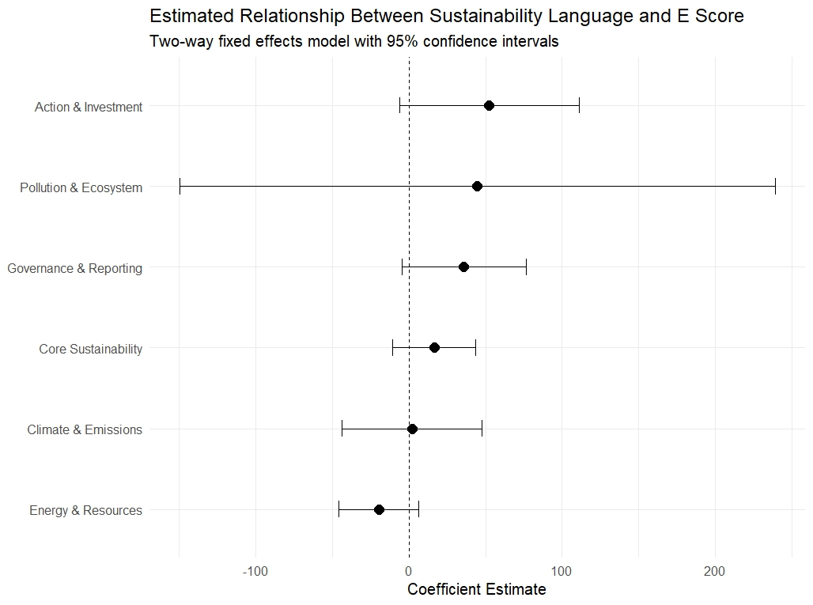
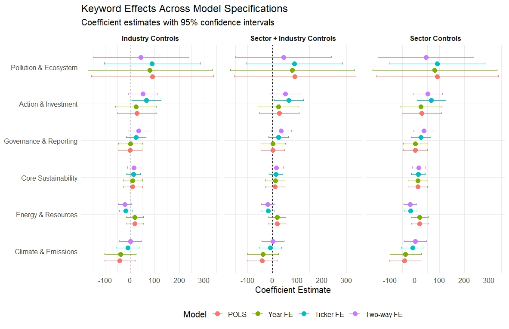
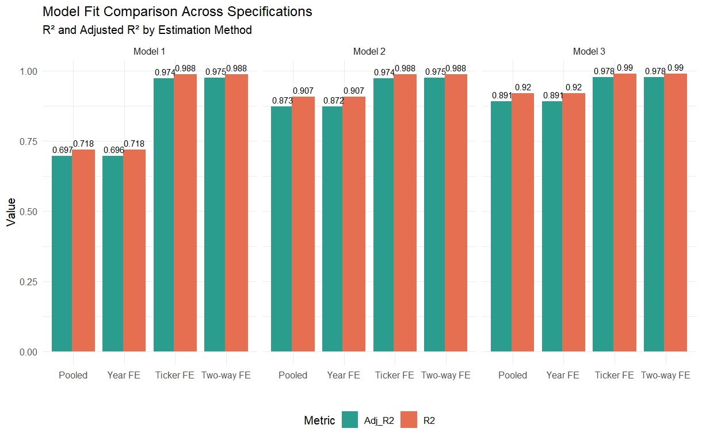

# Introduction

Environmental sustainability has become an increasingly important issue for corporations, investors, regulators, and consumers. In response to growing pressure from stakeholders, many firms publish sustainability reports and Environmental, Social, and Governance (ESG) disclosures intended to communicate their environmental commitments and progress. Companies frequently emphasize goals such as carbon reduction, renewable energy adoption, waste reduction, and long-term sustainability initiatives. However, an important question remains: Do firms’ sustainability communications reflect actual environmental performance, or do they sometimes overstate environmental responsibility?

This concern is central to discussions of greenwashing, commonly defined as the practice of portraying an organization as environmentally responsible through communication or marketing without equivalent substantive environmental performance. As sustainability claims become more common, distinguishing genuine environmental action from symbolic communication has become increasingly relevant for investors, regulators, and consumers. Misleading sustainability claims may distort investment decisions, reduce consumer trust, and undermine broader sustainability goals.

This project investigates whether sustainability-related language used in corporate reports is associated with measurable environmental performance among publicly traded firms. Specifically, the study asks:

**To what extent does sustainability-related communication in ESG reports align with firms’ environmental performance, and do discrepancies suggest potential evidence of greenwashing?**

Several related questions also motivate this analysis:

- Which categories of sustainability language are most associated with environmental performance?
- Does emphasizing sustainability communication predict higher environmental scores?
- Are there patterns suggesting firms communicate extensively about sustainability while exhibiting weaker environmental outcomes?

To address these questions, this study combines multiple datasets covering publicly traded firms between 2019 and 2021. Text from corporate sustainability reports is transformed into quantitative measures using keyword-based text analysis across several environmental communication themes, including climate emissions, resource use, governance and reporting, sustainability terminology, pollution and ecosystem concerns, and sustainability-related actions or investments. These text measures are merged with ESG environmental performance scores and financial characteristics.

The empirical analysis applies panel regression methods, including pooled OLS, firm fixed effects, year fixed effects, and two-way fixed effects models, to examine relationships between sustainability communication and environmental performance while accounting for unobserved firm-specific and temporal factors. Financial controls and industry characteristics are incorporated to reduce confounding influences.

The findings suggest that sustainability communication alone is not necessarily a reliable indicator of stronger environmental performance. Some categories of sustainability language exhibit weak or inconsistent associations with ESG environmental scores after controlling for firm characteristics and fixed effects. These results contribute to ongoing discussions regarding greenwashing by highlighting potential gaps between sustainability “talk” and measurable environmental outcomes.

This project contributes practically rather than purely theoretically. By combining ESG text analysis with panel regression techniques, the study provides evidence relevant for investors evaluating ESG disclosures, regulators seeking standardized reporting frameworks, and firms attempting to align sustainability messaging with substantive environmental improvements. The results also contribute to broader discussions surrounding ESG transparency and accountability.

# Background and Related Literature

Growing public concern regarding climate change and environmental sustainability has increased pressure on firms to disclose environmental initiatives and sustainability commitments. ESG reporting has become a widely used mechanism through which corporations communicate environmental performance to investors and stakeholders. However, expanding sustainability disclosure has also generated concerns regarding whether reported commitments accurately reflect environmental action.

Greenwashing refers broadly to situations in which organizations communicate environmental responsibility disproportionate to their actual environmental performance. Early work by Delmas and Burbano (2011) argues that greenwashing emerges from interactions among external pressures, organizational incentives, and weak monitoring systems. Firms may have incentives to portray themselves as environmentally responsible because sustainability claims improve reputation and stakeholder perceptions even when underlying practices remain unchanged.

Similarly, Walker and Wan (2012) distinguish between symbolic environmental actions and substantive environmental performance. Their findings suggest that symbolic sustainability communication without meaningful environmental improvement can create financial and reputational risks over time. This highlights the importance of evaluating whether environmental messaging corresponds with measurable outcomes rather than relying solely on disclosure quantity.

More recent studies directly examine the relationship between sustainability communication and environmental performance. Coen, Herman, and Pegram (2022) propose the “talk–walk” hypothesis, investigating whether firms’ climate-related commitments align with actual climate action. Their findings indicate substantial variation between corporate climate rhetoric and implemented environmental performance, suggesting that sustainability communication alone cannot reliably indicate genuine environmental progress.

Likewise, Zhang et al. (2023) analyze relationships between greenwashing and environmental performance and identify evidence that inconsistencies between sustainability claims and environmental outcomes may negatively affect perceptions of corporate responsibility. These findings reinforce concerns that extensive sustainability communication does not necessarily imply stronger environmental outcomes.

Research also raises questions regarding ESG measurement itself. Berg, Kölbel, and Rigobon (2022) demonstrate substantial divergence among ESG ratings across providers, suggesting that ESG metrics may vary depending on methodology and measurement choices. Their work highlights broader challenges in evaluating environmental performance and interpreting ESG indicators consistently.

Regulatory developments further increase the importance of accurate sustainability disclosure. The U.S. Securities and Exchange Commission (SEC) has proposed enhanced standardization of climate-related disclosures to improve comparability and transparency for investors. Similarly, the Federal Trade Commission (FTC) Green Guides provide guidance intended to reduce misleading environmental marketing claims. These developments reflect growing recognition that sustainability communication requires stronger accountability mechanisms.

Despite extensive discussion regarding greenwashing, relatively fewer empirical studies combine text-based measures of sustainability communication with panel analyses of environmental performance over time using firm-level data. Existing literature often examines disclosure quality or ESG outcomes separately. This project contributes by integrating keyword-based text analysis of sustainability reports with ESG environmental scores and financial characteristics across multiple years.

By evaluating whether sustainability-related communication predicts environmental performance after accounting for firm and time effects, this study aims to provide empirical evidence regarding the extent to which sustainability messaging reflects substantive environmental outcomes versus potential greenwashing behavior.

# Data

## Data Sources

This study combines three primary data sources to construct a panel dataset linking sustainability communication, ESG performance, and firm financial characteristics.

The first source is the ESG Sustainability Reports of S&P 500 Companies dataset obtained from Kaggle, which contains preprocessed textual content from sustainability and ESG reports published by S&P 500 firms. The dataset provides report text and ESG-related measures across multiple years and serves as the foundation for constructing sustainability communication variables through text analysis.

Dataset source:

Chopra, J. ESG Sustainability Reports of S&P 500 Companies. Kaggle. https://www.kaggle.com/datasets/jaidityachopra/esg-sustainability-reports-of-s-and-p-500-companies/data Accessed: \[March 19th, 2026\]

The second source consists of firm-level financial performance data for S&P 500 companies from 2019–2021, including variables such as assets, operating cash flow, stockholders’ equity, and stock return measures. One year of financial data was initially provided by the course instructor, and additional years were retrieved using Python (Spyder) by applying the same extraction procedure to obtain comparable firm-level financial information across years.

The third source consists of ESG scores, including environmental (E), social (S), governance (G), and total ESG scores, merged with financial and textual datasets to evaluate relationships between sustainability communication and environmental performance.

These datasets were merged using firm ticker symbols and year identifiers to construct the final analytical panel.

## Unit of Observation

The primary unit of observation is a firm-year, where each row represents one publicly traded company observed in a specific year.

The final analytical dataset contains:

- 290 firm-year observations
- Approximately 145 firms
- Observations spanning 2020–2021 after lag construction and filtering
- 18 final variables

The reduction in observations results from balancing the panel, requiring firms to appear across years and retaining complete observations for financial controls and lagged sustainability variables.

##Sample and Scope

The analysis focuses on S&P 500 firms with available sustainability reports, ESG scores, and financial information.

The original text dataset covered multiple years, but filtering procedures were applied to construct a balanced panel and create lagged sustainability communication variables. Firms lacking complete information across years or containing missing financial variables were excluded.

The resulting sample emphasizes firms with:

1.  Available sustainability report text
2.  ESG environmental scores
3.  Financial performance measures
4.  Industry classifications
5.  Complete observations after lag construction

Because lagged explanatory variables are used, observations from earlier years are necessary to predict later environmental performance outcomes.

## Key Variables

**Outcome Variable**

The primary dependent variable is:

- Environmental ESG Score (e_score): Measures environmental performance and serves as the main indicator of substantive environmental outcomes.

Higher values indicate stronger environmental performance.

**Sustainability Communication Variables**

Sustainability communication is measured using keyword proportions derived from ESG report text. Text was categorized into six conceptual groups:

| Variable | Interpretation |
|------------------------------------|------------------------------------|
| `kw_pollution_ecosystem_lag` | Pollution, biodiversity, ecosystem communication |
| `kw_climate_emissions_lag` | Climate, carbon, emissions communication |
| `kw_action_investment_lag` | Sustainability actions and investments |
| `kw_sustainability_core_lag` | General sustainability terminology |
| `kw_governance_reporting_lag` | Governance, reporting, disclosure communication |
| `kw_energy_resources_lag` | Energy, resource use, recycling communication |

Variables are measured as lagged proportions of sustainability-related keywords relative to total report words, intended to capture prior sustainability communication intensity.

**Financial Control Variables**

The empirical models include several financial controls:

- Assets → proxy for firm size
- Stockholders’ Equity → financial structure and capitalization
- Operating Cash Flow → operational performance and liquidity
- Total Return Percentage (TotalReturnPct) → stock performance measure

Industry characteristics are controlled using:

- GICS Sector
- GICS Subindustry

These controls help account for structural differences across firms and industries.

## Data Cleaning and Transformation

Several preprocessing and transformation steps were performed before model estimation.

**Text preprocessing** Corporate report text was cleaned through:

- Removal of HTML tags
- Removal of URLs
- Removal of punctuation and nonalphabetic characters
- Tokenization into individual words
- Removal of stop words
- Standardization of whitespace

Keyword frequencies were then calculated and transformed into proportional measures.

**Panel construction**

Firm-year observations were merged across:

- ESG reports
- Financial datasets
- ESG score datasets

The panel was filtered to retain firms appearing consistently across years. Lagged sustainability communication variables were created to evaluate whether prior communication predicts subsequent environmental performance.

**Missing values**

Missing values in keyword proportions were replaced with zero when appropriate, while incomplete observations for major controls or outcomes were excluded during final panel construction.

**Data Quality and Limitations**

Several limitations should be acknowledged.

First, keyword-based text analysis measures the frequency of sustainability communication rather than communication quality or sincerity. High keyword frequency may reflect substantive environmental initiatives or merely stronger sustainability messaging.

Second, ESG scores themselves may contain measurement inconsistencies across methodologies, as prior literature notes divergence among ESG ratings.

Third, restricting analysis to firms with complete observations reduces sample size and may introduce selection bias toward larger or more transparent firms.

Finally, because the dataset focuses primarily on S&P 500 companies, findings may have limited generalizability beyond large U.S. publicly traded firms.

Despite these limitations, combining textual sustainability disclosures, ESG outcomes, and financial controls provides a useful framework for examining potential discrepancies between sustainability communication and measurable environmental performance.

# Empirical Strategy / Methods

## Empirical Strategy

The objective of this study is to examine whether sustainability-related communication in corporate reports is associated with firms’ measurable environmental performance. Specifically, the analysis investigates whether firms emphasizing sustainability topics in ESG disclosures subsequently exhibit stronger environmental performance, measured using ESG environmental scores. Because the research question concerns relationships across firms and over time, panel regression methods are used to exploit both cross-sectional and temporal variation.

The empirical approach combines keyword-based text analysis with panel fixed effects regression models. Text analysis converts sustainability-related language in corporate disclosures into quantitative variables representing different categories of environmental communication. These variables are then incorporated into panel regression models to evaluate whether sustainability communication predicts environmental performance after accounting for financial characteristics, industry differences, and unobserved firm-level heterogeneity.

This approach is appropriate because sustainability communication and environmental performance are likely influenced by persistent firm characteristics, such as organizational culture, industry structure, or long-term sustainability strategies, which cannot be directly observed. Fixed effects models help reduce bias arising from these time-invariant factors.

## Text Analysis and Variable Construction

To quantify sustainability communication, corporate sustainability reports were processed using natural language processing techniques. Text preprocessing included:

- Removal of HTML tags and URLs
- Removal of punctuation and non-alphabetic characters
- Tokenization into individual words
- Stop-word removal
- Standardization of text into analyzable word frequencies

Keyword dictionaries were developed to classify sustainability-related communication into six conceptual categories:

1.  **Core sustainability terms**

- Example keywords: sustainability, ESG, environmental, green

2.  **Climate and emissions**

- Example keywords: climate, carbon, emissions, net-zero

3.  **Energy and resource use**

- Example keywords: renewable, energy, recycling, water

4.  **Pollution and ecosystem concerns**

- Example keywords: biodiversity, pollution, habitat

5.  **Governance and reporting**

- Example keywords: disclosure, regulation, compliance

6.  **Action and investment**

- Example keywords: invest, mitigation, transition, innovation

For each firm-year observation, keyword frequencies were converted into proportions relative to total words appearing in reports. These proportions represent the intensity of sustainability communication within each conceptual category. Lagged versions of these variables were then created to examine whether prior sustainability communication predicts subsequent environmental performance.

## Panel Regression Framework

The primary outcome variable is the firm's environmental ESG score (E score). Independent variables include lagged sustainability communication measures, while financial and industry controls account for differences in firm characteristics.

$$
E_{Score,it}
=
\beta_0
+
\beta_1 KW_{Pollution,i,t-1}
+
\beta_2 KW_{Climate,i,t-1}
+
\beta_3 KW_{Action,i,t-1}
+
\beta_4 KW_{Sustainability,i,t-1}
+
\beta_5 KW_{Energy,i,t-1}
+
\beta_6 KW_{Governance,i,t-1}
+
\delta X_{it}
+
\alpha_i
+
\lambda_t
+
\varepsilon_{it}
$$

where:

- $E\_Score_{it}$: environmental ESG score for firm $i$ at year $t$

- $KW$: lagged keyword proportions representing sustainability communication categories

- $X_{it}$: financial and industry control variables

- $\alpha_i$: firm fixed effects

- $\lambda_t$: year fixed effects

- $\varepsilon_{it}$: error term

Financial controls include:

- Total return percentage

- Total assets

- Stockholders’ equity

- Operating cash flow

Industry effects are controlled using GICS sector and subindustry classifications when applicable.

## Model Specifications

Four regression specifications are estimated to compare results across different assumptions:

**1. Pooled Ordinary Least Squares (POLS)**

The pooled model ignores firm-specific and temporal heterogeneity and estimates average relationships across all observations.

**2. Year Fixed Effects Model**

Year fixed effects account for economy-wide or regulatory changes affecting all firms in a given year, including evolving ESG disclosure expectations.

**3. Firm (Ticker) Fixed Effects Model**

Firm fixed effects control for time-invariant firm characteristics such as organizational culture, business model, or long-term sustainability orientation.

**4. Two-Way Fixed Effects Model**

Two-way fixed effects simultaneously control for:

- Firm-specific characteristics
- Year-specific shocks

This specification provides the strictest control for unobserved heterogeneity and serves as the primary model for interpretation.

## Interpretation and Identification

The results should be interpreted as associational rather than causal relationships. Although lagged sustainability communication variables and fixed effects help reduce some concerns regarding reverse causality and omitted variables, the empirical design does not establish definitive causal effects.

Consequently, significant coefficients should be interpreted as evidence that changes in sustainability-related communication are associated with changes in environmental performance, rather than proof that communication directly causes environmental outcomes.

The analysis instead aims to evaluate whether sustainability disclosures align with measurable environmental performance and whether discrepancies may indicate potential greenwashing behavior.

# Results

## Main Regression Results

The primary empirical analysis estimates pooled OLS (POLS), year fixed effects, firm fixed effects, and two-way fixed effects models to evaluate whether sustainability communication predicts environmental ESG performance. The preferred specification is the two-way fixed effects model, which controls simultaneously for firm-specific and year-specific unobserved heterogeneity.

### Sustainability Communication and Environmental Performance

Across simpler specifications, several sustainability communication variables exhibit statistically significant relationships with environmental ESG scores.

In models without firm fixed effects, core sustainability language (kw_sustainability_core_lag) shows a strong positive association with environmental scores. For example, the coefficient exceeds 100 and is statistically significant at the 1% level in pooled and year fixed effects models.

However, this significance disappears after controlling for firm fixed effects:

- **POLS**: coefficient ≈ 103\*\*\*
- **Year FE**: coefficient ≈ 103\*\*\*
- **Firm FE**: coefficient ≈ 15 (not significant)
- **Two-way FE**: coefficient ≈ 17 (not significant)

This pattern suggests firms that generally communicate more about sustainability tend to exhibit stronger environmental scores, but increases in sustainability language within the same firm over time do not necessarily correspond to improved environmental performance.

This finding is broadly consistent with concerns raised in prior greenwashing literature regarding discrepancies between sustainability communication and substantive environmental outcomes.

### Action-Oriented Sustainability Communication

The most consistent positive association appears for action and investment language (kw_action_investment_lag).

In firm fixed effects models:

- Firm FE coefficient: ≈ 66.7 (p \< 0.05)

In two-way fixed effects:

- coefficient: ≈ 52.4 (p \< 0.10)

Unlike broader sustainability terminology, communication emphasizing actions, investments, mitigation, innovation, or transitions appears more closely associated with stronger environmental performance.

This may indicate that specific commitments and implementation-focused sustainability communication align more closely with measurable environmental outcomes than general sustainability rhetoric.

### Governance and Reporting Communication

Governance and reporting language (kw_governance_reporting_lag) becomes marginally positive in more restrictive fixed effects specifications:

- Two-way FE: coefficient ≈ 35.9 (p \< 0.10)

This suggests disclosure quality and reporting-related communication may contribute modestly to environmental performance, although evidence remains relatively weak.

### Climate and Pollution Communication

Communication related to climate, emissions, pollution, and ecosystems generally shows inconsistent or insignificant relationships after accounting for fixed effects.

This implies increased discussion of climate or environmental risks alone does not necessarily predict stronger environmental outcomes.

Consequently, communication intensity regarding environmental concerns may not reliably indicate substantive environmental improvement.

### Robustness Across Specifications

Regression results remain broadly similar across models incorporating:

**1. Industry controls** **2. Sector controls** **3. Combined sector and industry controls**

The substantive interpretation remains unchanged: most sustainability communication variables lose significance after accounting for firm-specific heterogeneity, while action-oriented sustainability language retains some predictive association. This consistency strengthens confidence that findings are not driven solely by industry composition.

## Visualizations and interpretations

This figure presents coefficient estimates and 95% confidence intervals from the preferred two-way fixed effects model. Most sustainability communication variables have confidence intervals overlapping zero, suggesting weak evidence of systematic relationships with environmental ESG performance after controlling for firm and year effects. Among the keyword categories, action and investment language shows the strongest positive association with environmental ESG scores, indicating that communication focused on concrete sustainability actions may align more closely with measurable environmental outcomes. In contrast, general sustainability terminology, climate-related language, and pollution-related communication do not demonstrate robust relationships with environmental performance. Overall, the findings suggest that increases in sustainability communication alone do not consistently correspond to improved environmental outcomes, highlighting potential gaps between sustainability rhetoric and substantive environmental performance.

This figure compares coefficient estimates across pooled OLS, year fixed effects, firm fixed effects, and two-way fixed effects models under industry, sector, and combined control specifications. Overall, coefficient patterns remain relatively stable across control structures, suggesting the findings are robust to alternative industry classifications. A notable pattern is that general sustainability language shows stronger positive associations in simpler models but weakens after introducing firm fixed effects, indicating that differences between firms explain much of the relationship. In contrast, action-oriented sustainability communication consistently exhibits the strongest positive association with environmental ESG performance across more restrictive specifications. Most confidence intervals overlap zero, however, implying limited statistical evidence that increases in sustainability communication within firms over time systematically predict stronger environmental outcomes. These findings suggest that concrete sustainability actions may align more closely with environmental performance than broad sustainability rhetoric.

A figure above compares $R^2$ and adjusted $R^2$ values across pooled OLS, year fixed effects, firm fixed effects, and two-way fixed effects models under alternative control specifications. Model fit improves substantially after introducing firm fixed effects, with adjusted $R^2$ increasing from approximately 0.70–0.89 in pooled and year fixed effects models to approximately 0.97–0.98 in firm and two-way fixed effects models. This suggests that persistent firm-specific characteristics explain a large proportion of variation in environmental ESG scores, whereas year-specific effects contribute relatively little additional explanatory power. Similar $R^2$ patterns across specifications indicate the findings are robust to different control structures. However, high model fit should be interpreted cautiously, as it likely reflects stable differences across firms rather than strong predictive effects of sustainability communication variables alone.

## Connection to the Research Question

The findings indicate that greater sustainability communication alone does not consistently predict stronger environmental ESG performance after controlling for firm and year effects. Positive relationships observed in simpler models largely disappear after introducing fixed effects, suggesting that persistent differences across firms explain much of the association between sustainability communication and environmental outcomes. However, action-oriented sustainability language, such as communication emphasizing investments, implementation, and mitigation, shows a more consistent positive relationship with environmental ESG scores.

These results provide partial support for concerns raised in greenwashing literature, implying that broad sustainability rhetoric may not reliably reflect substantive environmental improvement, while more concrete sustainability commitments appear more closely aligned with measurable outcomes.

Several questions remain unresolved. Keyword frequency measures cannot distinguish genuine commitment from symbolic disclosure, ESG scores may contain measurement limitations, and the observational design identifies associations rather than causal relationships. Future research could examine longer time horizons or alternative measures of environmental performance to better assess whether sustainability communication translates into meaningful environmental change.

# Discussion and Implications

## Interpretation of Findings

This study examined whether sustainability communication in corporate disclosures aligns with measurable environmental performance. The findings suggest that greater sustainability communication alone does not consistently predict stronger environmental ESG performance after accounting for firm-specific and year effects. Relationships observed in simpler models largely disappeared after introducing fixed effects, indicating that persistent differences across firms explain much of the association between sustainability communication and environmental outcomes.

The most important insight is that the content of sustainability communication appears more important than communication volume alone. Broad sustainability language showed weak relationships with environmental performance in more restrictive models, whereas communication emphasizing concrete actions, investments, and implementation exhibited more consistent positive associations. This suggests that action-oriented sustainability disclosures may provide more meaningful signals of environmental performance than general sustainability rhetoric.

These findings are broadly consistent with prior literature on greenwashing, which argues that sustainability communication does not always reflect substantive environmental improvement.

## Business, Policy, and Sustainability Implications

The findings have implications for firms, investors, and regulators. For companies, the results suggest sustainability communication strategies may be more credible when focused on measurable actions and environmental progress rather than broad sustainability claims. For investors, sustainability disclosures should be interpreted cautiously, as greater sustainability language does not necessarily indicate stronger environmental performance.

The results also support ongoing efforts to strengthen ESG reporting standards and improve transparency in sustainability disclosures. If sustainability communication does not consistently align with environmental outcomes, more standardized reporting may help reduce misleading claims and improve comparability across firms.

## Recommendations and Future Considerations

Based on these findings, organizations should emphasize evidence-based sustainability communication, linking sustainability claims to specific actions and measurable outcomes. However, these recommendations should be interpreted cautiously because keyword frequency measures cannot distinguish genuine commitment from symbolic communication, ESG scores contain measurement limitations, and the analysis identifies associations rather than causal relationships.

Future research could examine longer time periods or alternative measures of environmental performance to better understand whether sustainability communication translates into meaningful environmental improvement over time.

Overall, the findings suggest sustainability communication is most informative when supported by evidence of concrete environmental action rather than sustainability rhetoric alone.

# Conclusion

As sustainability disclosures become increasingly important for investors, regulators, and consumers, an important question remains: Do corporate sustainability communications reflect genuine environmental performance? Using panel data from S&P 500 firms, this study combined sustainability report text, ESG environmental scores, and financial variables to examine whether sustainability communication predicts environmental performance.

The results suggest that greater sustainability communication alone does not consistently correspond to stronger environmental ESG performance after accounting for firm and year effects. While broad sustainability language showed weak relationships with environmental outcomes, communication emphasizing concrete actions and investments demonstrated more persistent positive associations.

These findings imply that sustainability disclosures may be most informative when supported by measurable environmental actions rather than generalized sustainability rhetoric. As ESG reporting continues to expand, improving alignment between sustainability communication and observable environmental outcomes may become increasingly important for reducing greenwashing concerns and strengthening transparency. Future research could examine longer time periods or alternative measures of environmental performance to better understand whether sustainability communication translates into meaningful environmental improvement over time.

# References

Coen, D., Herman, K., & Pegram, T. (2022). Are corporate climate efforts genuine? An empirical analysis of the climate ‘talk–walk’ hypothesis. Business Strategy and the Environment, 31(7), 3040-3059.

Walker, K., & Wan, F (2012). The Harm of Symbolic Actions and Green-Washing: Corporate Actions and Communications on Environmental Performance and Their Financial Implications. Journal of Business Ethics, 109, 227-242.

Delmas, M. A., & Burbano, V. C. (2011). The Drivers of Greenwashing. California Management Review, 54(1), 64-87.

Zhang, K., Pan, Z., Janardhanan, M. et al. (2023). Relationship analysis between greenwashing and environmental performance. Environment, Development and Sustainability, 25, 7927-7957.

Berg, F., Kölbel, J. F., & Rigobon, R. (2022). Aggregate Confusion: The Divergence of ESG Ratings. Review of Finance, 26(6), 1315-1344.
